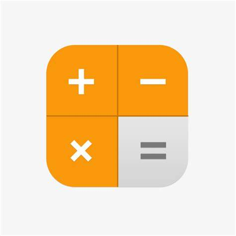

<h1 align="center">Calculator-Android Project</h1>

## Introduce
> 中文: 安卓计算器项目

 
This is a Calculator in Android by Sycreaper Team. 

> 中文: 这是一个由 Sycreaper 设计的计算器应用。

## Install

Please use `Android Studio` to git clone. 

> 中文: 请使用 `Android Studio` 的 `Git` 进行克隆

Or using an Android phone. 

> 中文: 或者使用一个安卓手机进行安装。

### Version List
| App Version              | Min SDK Level |
|:-------------------------|:--------------|
| OnlyAndroid-v0.5.0-alpha | SDK 22        |
| OnlyAndroid-v1.0         | SDK 35        |
| OnlyAndroid-v1.0.1       | SDK 21        |